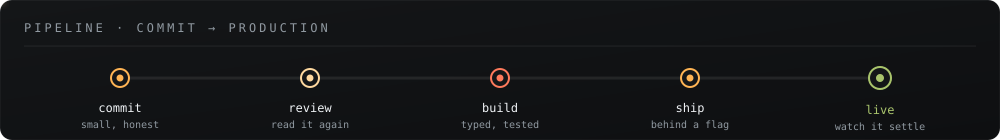

 

  
  

 

  

  
  

 

  

 

  

 

<picture>
  <source media="(prefers-color-scheme: dark)" srcset="https://raw.githubusercontent.com/JackLuciano/JackLuciano/output/snake-dark.svg" />
  <source media="(prefers-color-scheme: light)" srcset="https://raw.githubusercontent.com/JackLuciano/JackLuciano/output/snake-light.svg" />
  
</picture>

 

 

  

<code>the cards on this page rebuild themselves nightly · assets/ is generated, not hand-drawn</code>

