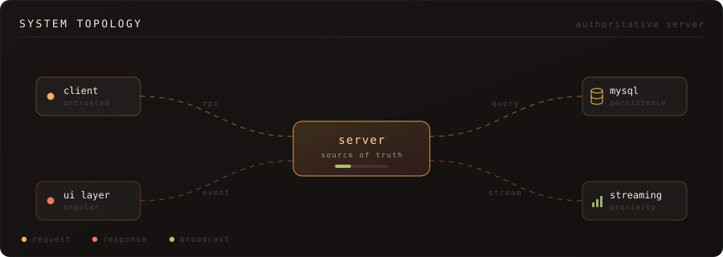
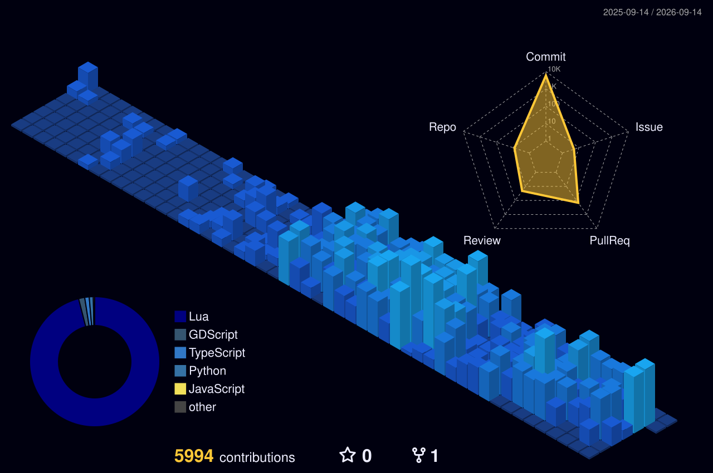

 

 

  
  

 

  
  

 

  

 

  

 

### `>` a year of commits, as a skyline

 

### `>` the snake eats my contributions

<picture>
  <source media="(prefers-color-scheme: dark)" srcset="https://raw.githubusercontent.com/JackLuciano/JackLuciano/output/snake-dark.svg" />
  <source media="(prefers-color-scheme: light)" srcset="https://raw.githubusercontent.com/JackLuciano/JackLuciano/output/snake-light.svg" />
  
</picture>

 

### `>` toolchain

 

### `>` projects

<table>
<tr>
<td width="100%" valign="top">

**[`biro-butor`](https://biro-butor.vercel.app/)** &nbsp;·&nbsp; 

Office furniture showcase site — product gallery, responsive
layout, deployed on Vercel.

</td>
</tr>
</table>

`personal site in progress — it lands here when it ships`

 

<table>
<tr>
<td width="50%" valign="top">

**`what I build`**

Real-time multiplayer game servers — persistence layers,
streaming systems, permission models, and the UI that
sits on top of all of it. Big codebases, many moving
resources, everything talking to everything.

Most of it lives in private repos, which is why the
graph above counts what you can't browse.

</td>
<td width="50%" valign="top">

**`how I work`**

Server is the source of truth, the client is an
adversary. Reactive state over polling. Delete more
lines than I add, when I can get away with it.

Cards on this page are generated from the GitHub API by
a workflow in this repo — no third-party badge services.

</td>
</tr>
</table>

 

### `>` contact

 

`built in the dark · powered by coffee and stack traces`

